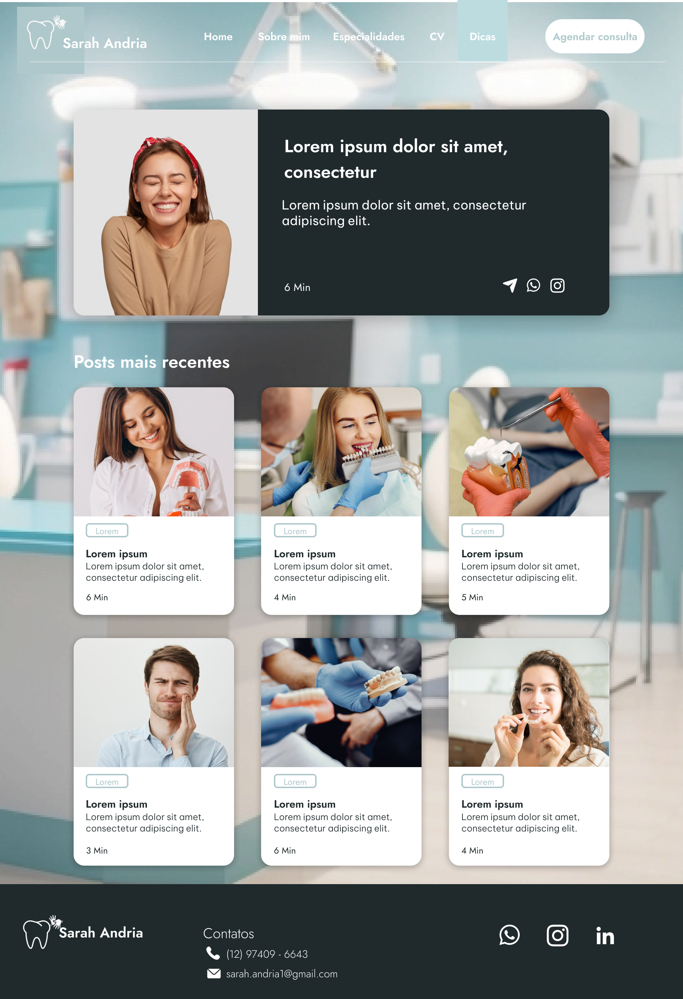

<h1>
 Dentist Website </h1>

### Sobre o Projeto

Desenvolvimento de site rápido e responsivo para profssional da área de Odontologia.

#### Tecnologias
      

 

### Projeto
 

 

### Mobile version

